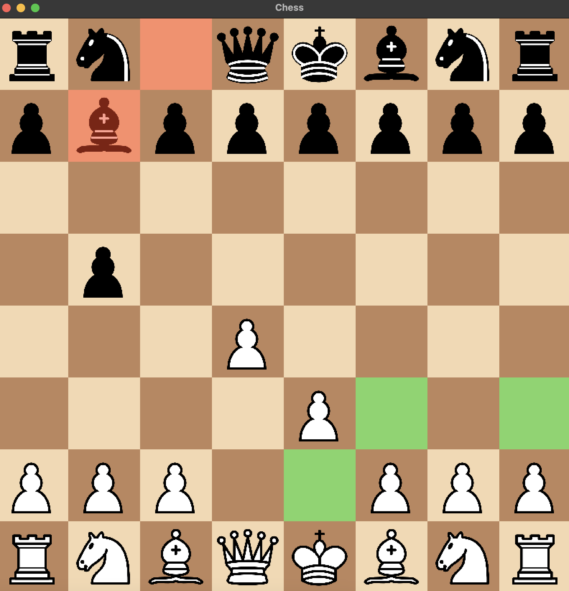
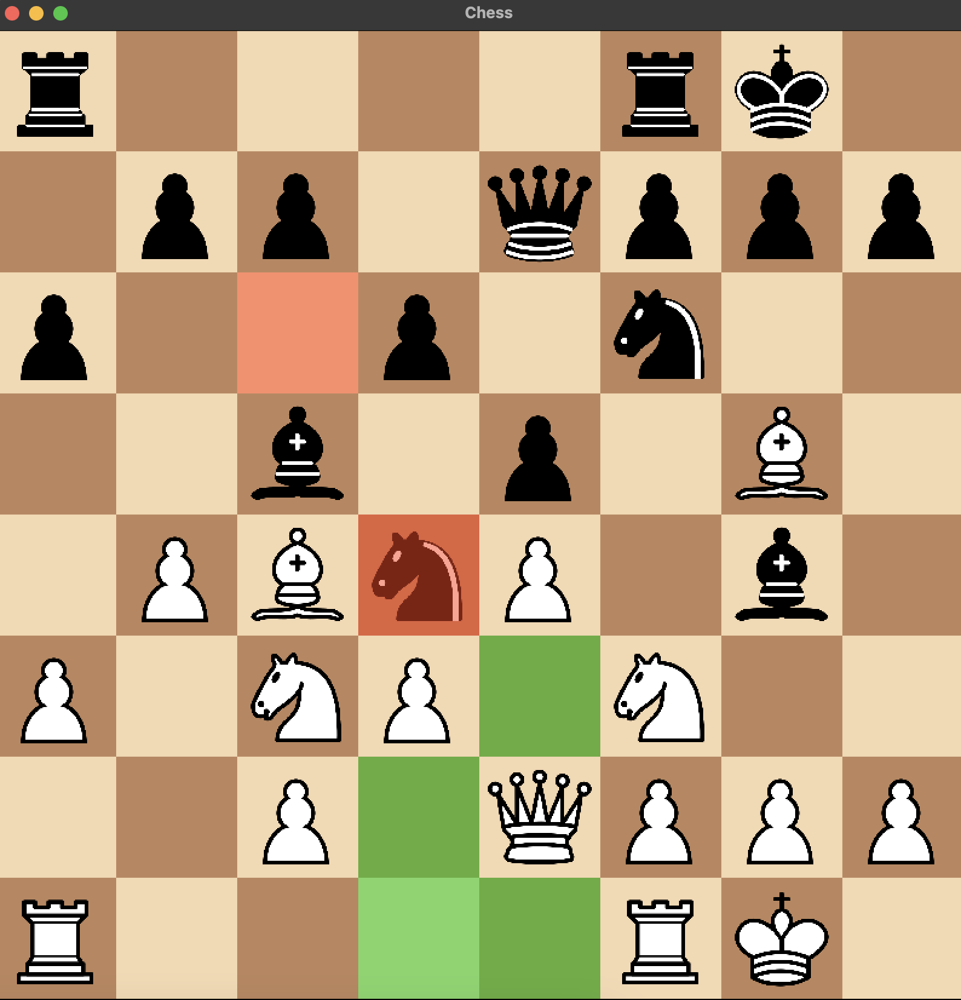

# BadFish ChessEngine

A really bad version of StockFish in C++17 that can beat Martin bot on chess.com

---
## Image Gallery
|  |  |
|-------------------------------------|-------------------------------------|
| Opening                             | Middlegame                          |
- **Red moves**: Highlight the previous move.
- **Green moves**: Highlight legal moves you can play.
## **Overview**
BadFish ChessEngine is a simplified chess engine built in **C++17**, featuring:
- A **multithreaded minimax algorithm with alpha-beta pruning** for computer play.
- A graphical interface using **SFML** for real-time visualisation, including move highlighting.
- Two modes of play:
  - **Player vs Player** for local multiplayer.
  - **Player vs Computer**, where the computer leverages the custom chess engine.

## **Prerequisites**
Before building the project, ensure you have the following installed:
- **CMake** (3.10+)
- **SFML** (2.5+)
- A C++17-compatible compiler (e.g., GCC, Clang, or MSVC)

## Getting Started
To use, first clone the repo

```bash
git clone git@github.com:Hamburglers/BadFish-ChessEngine.git
```
Create a build directory and navigate into it
```bash
mkdir build
cd build
```
Cmake is used to manage the building of this project and SFML is used for the GUI, so install these it if not already. These next steps assume you are in the `build` directory.
### To use Player vs Player
```bash
cmake -DCOMPUTER_MODE=OFF ..
make
./ChessGame
```
### To use Player vs Computer
```bash
cmake -DCOMPUTER_MODE=ON ..
make
./ChessGame
```
## Notes
- On checkmate/stalemate, the board will freeze (intended), CTRL+C in the terminal to quit.
- Depth of 3 is preselected in `Engine.cpp` which takes about 1 second per move. Any higher will take longer > 10second.
